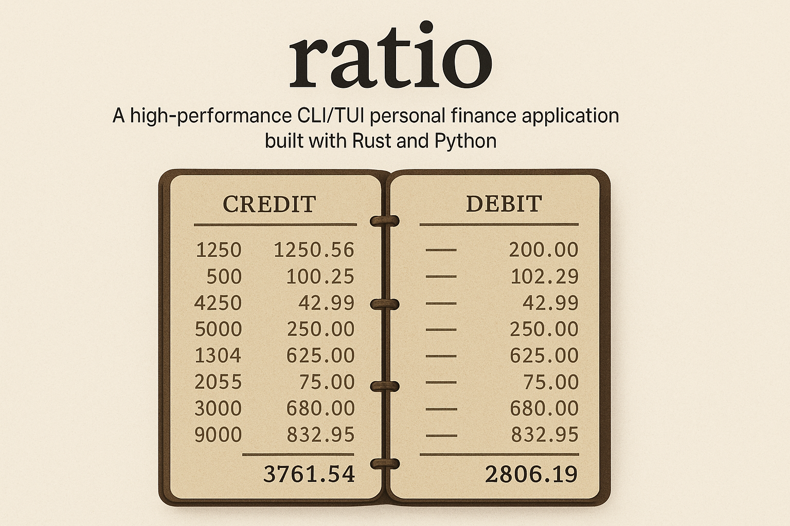

## Etymology and Philosophy

The name "Ratio" draws from its Latin roots, where it meant not just "proportion" or "reason" but also "calculation", "account", and "reckoning" in ancient Roman finance. Romans would ask citizens to present their accounts in symmetrical tablets to achieve "parem rationem" — ensuring that credits and debits were accurately balanced. This concept of balance and symmetry in accounting reflects both the mathematical precision and ethical dimension of proper financial management that this application strives to embody.

## Overview

Ratio is an open-source personal finance tool inspired by GnuCash but focused on implementing only the necessary features for effective household financial management. Built with a hybrid Rust/Python architecture, Ratio provides a fast, efficient CLI/TUI interface while allowing extensibility through Python modules.

## Quickstart

```bash
# Clone repository
git clone https://github.com/yourusername/ratio.git
cd ratio

# Start PostgreSQL (requires Docker)
docker-compose up -d postgres

# Build and run
cargo build
cargo run
```

For detailed setup instructions and development environment configuration, see [DEVELOPING.md](DEVELOPING.md).

## Documentation

- **[DEVELOPING.md](DEVELOPING.md)** - Complete development guide, workflow, and spec-driven approach
- **[CONTRIBUTING.md](CONTRIBUTING.md)** - Guidelines for contributing to the project
- **[CLINE.md](CLINE.md)** - Working with Cline and other LLMs on this project
- **[specs/README.md](specs/README.md)** - Detailed specifications for all components and features

## Core Features

- **[Account Tracking](specs/features/accounts/account-tracking.md)** - Track multiple accounts in a unified interface
- **[Transaction Management](specs/features/transactions/transaction-management.md)** - Record and categorize financial transactions
- **[Transaction Scheduling](specs/features/scheduling/transaction-scheduling.md)** - Set up recurring transactions
- **Double-Entry Bookkeeping** - Maintain accurate financial records with built-in validation
- **Balance Optimization** - Maximize investments while ensuring bill coverage
- **Data Visualization** - Terminal-based reports and charts

## Technical Architecture

Ratio uses a modular, layered architecture with clear separation of concerns:

```
CLI/TUI (Rust) ↔ gRPC API Layer (Rust) ↔ Accounting Kernel (Rust) ↔ PostgreSQL
                                           ↕
                                      Extensions (Python)
```

### Core Components

- **[Accounting Kernel](specs/components/kernel/accounting-kernel.md)** - Core accounting engine
- **[Money Handling](specs/components/kernel/money-handling.md)** - Financial calculations and currency support
- **[Extension System](specs/components/kernel/extension-system.md)** - Hook system and Python integration
- **[Terminal UI](specs/components/tui/terminal-interface.md)** - User interface with tui-rs and crossterm
- **[API Design](specs/architecture/api-design.md)** - gRPC service definitions
- **[Data Model](specs/architecture/data-model.md)** - Database schema with double-entry support
- **[Technology Stack](specs/architecture/tech-stack.md)** - Tools, libraries, and implementation choices

## Development Roadmap

Ratio is being developed in phases:

- **Phase 1: [MVP (Current Focus)](specs/iterations/iteration-1-mvp.md)** - Core accounting kernel, TUI, and essential features
- **Phase 2: Enhanced Features** - Subscription detection, receipt scanning, advanced forecasting
- **Phase 3: Extended Ecosystem** - Mobile app, investment tracking, tax preparation

See the [iteration plans](specs/iterations/) for detailed development roadmaps.

## Prerequisites

- Rust 1.70+
- Python 3.9+
- PostgreSQL 15+
- Docker & Docker Compose (for development)

## Contributing

Contributions are welcome! This project is intended to be developed with assistance from LLM tools like Cline.

Before contributing, please read:
1. [CONTRIBUTING.md](CONTRIBUTING.md) for contribution guidelines
2. [DEVELOPING.md](DEVELOPING.md) for development workflow
3. [CLINE.md](CLINE.md) for working with LLMs effectively

## License

MIT License - See LICENSE file for details
